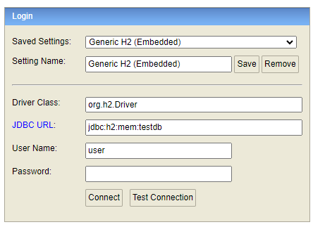

# Bike Rental Application

This project represents Bike Rental Application written in Java using Spring Boot. Custom database queries are written
in JPQL.

## Application functionality

Application provides functionality to manage cyclists, users and its reservations. When a new reservation is being
created, below rules are taken into the account:

- current time is taken as a start time of the reservation
- given bike and cyclist must exist
- it's not allowed to reserve bike with other status than *'FREE'*
- if reservation is created without defining its duration, then it's valid by default for next 10 minutes
- by default after creation of the reservation its status is *'ACTIVE'*

When a reservation finishes, its status is being automatically changed to *'FINISHED'* and bike status is being changed
from *'RESERVED'* to *'FREE'*

BikeRentalApp provides REST API to perform bellow calls. For each endpoint there is written and example call using cURL
you can perform on your own in the terminal using cURL.

### Bikes API

- `/bikes` - returns list of all bikes \
  e.g. `curl localhost:8081/bikes`
- `/bikes/{id}` - returns bike with given id \
  e.g. `curl localhost:8081/bikes/1`
- `/bikes/{id}/sendToService` - changes status of the bike to *'IN_SERVICE'* \
  e.g. `curl localhost:8081/bikes/1/sendToService`

### Cyclists API

- `/cyclists` - returns list of all cyclists \
  e.g. `curl localhost:8081/cyclists`
- `/cyclists/{id}` - returns cyclist with given id \
  e.g. `curl localhost:8081/cyclists/1`

### Reservations API

- `/reservations` - returns list of all reservations \
  e.g. `curl localhost:8081/reservations`
- `/reservations/{id}` - returns reservation with given id \
  e.g. `curl localhost:8081/reservations/1`
- `/reservations/last` - returns last reservation based on end time \
  e.g. `curl localhost:8081/reservations/last`
- `/reservations/lastByBike/{bikeId}` - returns last reservation for given bike based on end time \
  e.g. `curl localhost:8081/reservations/last/2`
- `/reservations/new/{bikeId}/{cyclistId}` - creates new reservation for given cyclist and bike id for default time and
  returns newly created reservation if input data was positively validated \
  e.g. `curl localhost:8081/reservations/new/1/1`
- `/reservations/new/{bikeId}/{cyclistId}/{minutes}` - creates new reservation for given cyclist and bike id for given
  time and returns newly created reservation if input data was positively validated \
  e.g. `curl localhost:8081/reservations/new/1/1/30`
- `/reservations/cancel/{id}` - changes status of the reservation to *'CANCELLED'* \
  e.g. `curl localhost:8081/reservations/cancel/4`

## Data structure

Each data type has defined own structure:

#### Bike:

- id
- brand
- [status](src/main/java/com/mmokijewski/bikeRentalApp/enums/BikeStatus.java)

#### Cyclist:

- id
- first name
- last name

#### Reservation:

- id
- bike
- cyclist
- start timestamp
- end timestamp
- [status](src/main/java/com/mmokijewski/bikeRentalApp/enums/ReservationStatus.java)

## Database access

To make the project simple it uses H2 In-Memory Database with initial data defined
in [data.sql](src/main/resources/data.sql) file, so you can see some records just from the beginning after
initialization. After starting the application you can log into the database on http://localhost:8081/h2-console using
parameters like on the picture below (yes, there is no password).

